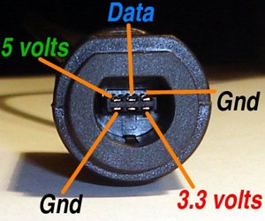
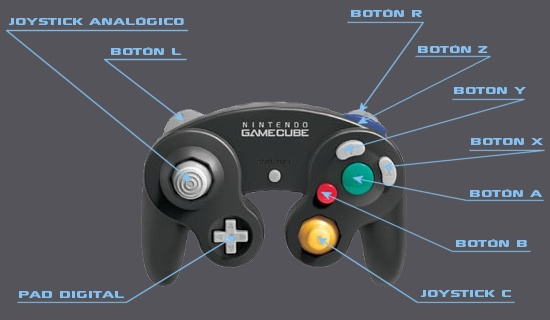

# Konami Code Arduino BETA

## Aproach

Por motivos varios, me vi en la necesidad de flashear una Wii con BootMii, pero al intentar ejecutar el proceso de restore, se me pidio que ingrese el [Konami Code](https://en.wikipedia.org/wiki/Konami_Code), y siendo que no tengo mando de GameCube (y me parecio caro para realizar solo esta accion) comence a revisar la opcion de emularlo de alguna forma sencilla.

Así fue que di con el repositorio en GitHub de [NicoHood / Nintendo](https://github.com/NicoHood/Nintendo) que me sirve de base para esta tarea.

Basicamente usando la libreria de [NicoHood](https://github.com/NicoHood), puedo simular un mando de GameCube y asi hacer que la Wii me tome el Konami Code. Me parecio senillo y economico, ya que solo se necesita contar con un arduino y algunos cables.

# Pinout del conector de la consola

# Nombre de los botones segun aparecen en el proyecto

